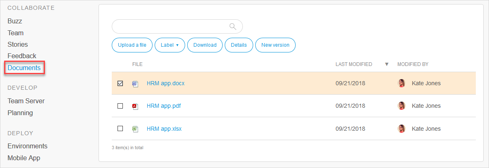

# Documents

## 1 Introduction

On the **Documents** page, you can upload files to your app project and replace existing files with newer versions.

## 2 Actions

You can perform the actions described below via the buttons on your app project's **Documents** page. To select an existing document, click the check box in front of the document name to select it.

### 2.1 Uploading a File

Click **Upload a file** to upload a new document:


All file types are allowed, and they are scanned for viruses by Mendix.


### 2.2 Using Labels

To add a label to a document or create a new label, use the options under **Label**:

### 2.3 Downloading a Document

To download a document, select the document and click **Download**.

### 2.4 File Details

Click **Details** to see the description of the document, comments, and all the versions of the document:

On the **Document** details page, you can perform the following actions:

* **Download** the document
* **Upload new version** of the document
* **Delete document**

### 2.5 New Version

To upload a new version of a document directly from the document list, select the document and click **New version**.

## 3 Read More

* [Buzz](buzz)
* [App Team](team)
* [Stories](stories)
