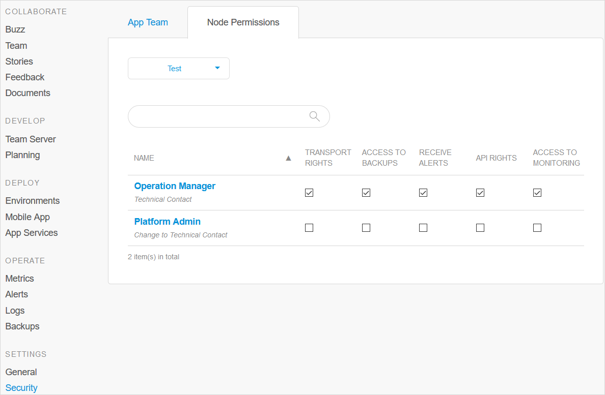

# Node Permissions

## 1 Introduction

Fine-grained access management for your Mendix Cloud environments is handled in the **Node Permissions** tab of the **Security** page for your app. See [App Settings](/developerportal/settings).

Here, the [Technical Contact](/developerportal/company-app-roles/technical-contact) can manage various permissions to the environments for each team member.

Each team member can subscribe to, or unsubscribe from, the alerts,

See [Company & App Roles](/developerportal/company-app-roles/index) to learn more about the roles of app team members.

## 2 Node Permissions

Node permissions allow you to give specific access to your nodes to individual members of a team.

### 2.1 User Roles for Managing Permissions

Only users with the *Technical Contact* role can manage the permission settings for the cloud node.

The permissions are set independently for each environment. You can choose the environment at the top of the *Node Permissions* tab. Changing the permissions for a *production* environment will require two-factor authentication (see [Two-Factor Authentication](two-factor-authentication)).

Only App Team members who have permission to *Deploy, Publish, and Monitor* can view the node permissions.



Note that only app team members with a *user role* which includes permission to *Deploy, Publish, and Monitor* the app will be listed in the Node Permissions tab.

You can change permissions for team members in the *App Team* tab: see [App Team](/developerportal/collaborate/team).



### 2.3 Accessing Node Permissions

To access the node permissions, do the following:

1. Click **Security** for your app.

2. Open the **Node Permissions** tab.

3. Select the environment for which you want to change permissions from the drop-down.

    

4. Complete two-factor authentication, if required for the selected environment.

### 2.3 Node Permissions

The Technical Contact can set the following node permissions.

#### 2.3.1 Transport Rights

With Transport Rights you can deploy new versions of the application to the node. You can also create new deployment packages, stop and start the environment, and change configuration settings such as constants and scheduled events.

For more information about deployment, see [Mendix Cloud](/developerportal/deploy/mendix-cloud-deploy).

#### 2.3.2 Access to Backups

The Access to Backups permission grants access to the backups of the environment. You can view, [create](/developerportal/operate/create-backup), [download](/developerportal/operate/download-backup), and [restore](/developerportal/operate/restore-backup) backups.

For more information, see [Backups](/developerportal/operate/backups).

#### 2.3.3 Receive Alerts

When Receives Alerts is checked, this user will receive an email when an alert is triggered.

Alerts are triggered by any of the following circumstances:

* the app goes offline unexpectedly
* the application logs a message with level *Critical*
* the health check fails
* one of a number of infrastructure problems occurs

#### 2.3.4 API Rights

With API rights, you can use the [Deploy API](/apidocs-mxsdk/apidocs/deploy-api) to get programmatic access to the environment.

As the API does not require two-factor authentication, it is disabled for the production environment by default. The Technical Contact can assign API access for each user.

{}
Other permissions are needed in addition to *API Rights*.

For example, to access backups via the API you need *Access to Backups* in addition to *API Rights*.


#### 2.3.5 Access to Monitoring

With the Access to Monitoring permission, you can view the application metrics, logs, and alerts under the **Operate** category in the [Developer Portal](http://home.mendix.com). This allows you to successfully operate your Mendix Cloud environments.

For more information, see [Metrics](/developerportal/operate/metrics), [Logs](/developerportal/operate/logs), and [Alerts](/developerportal/operate/monitoring-application-health).

## 3 Technical Contact

A cloud node has a single Technical Contact. They manage the cloud node and can edit the privileges of regular team members.

The Technical Contact can give the technical contact role to another team member. Click **Change to Technical Contact** under the user who should be the new Technical Contact. After this, the new user has the Technical Contact role, the old user does not.

For full details of the role of the Technical Contact, see [Technical Contact](/developerportal/company-app-roles/technical-contact).
