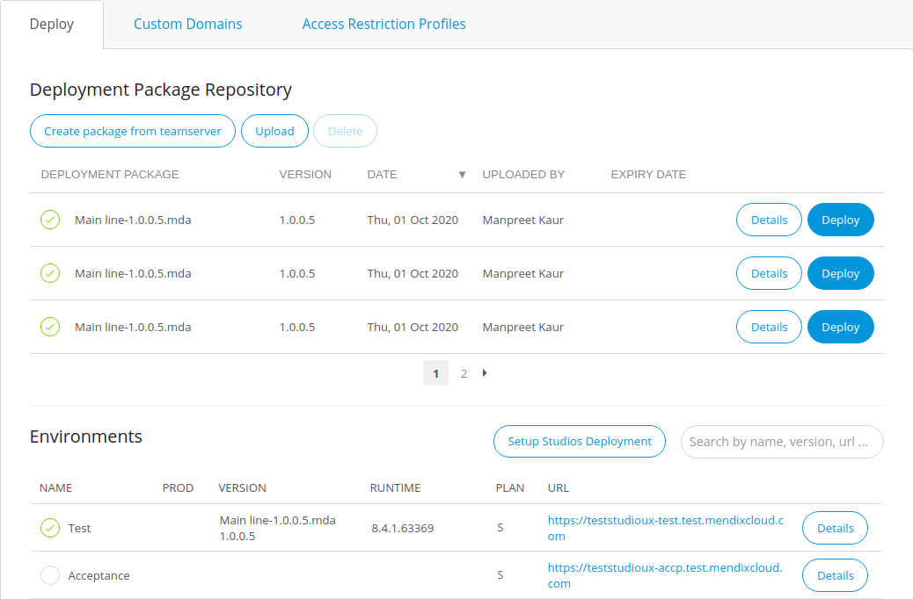

# Studio Deployment Settings

## 1 Introduction

If you have a licensed app, you need to select an environment for Mendix Studio separately. For more information on licensed apps and environments, see [Mendix Cloud](mendix-cloud-deploy) and [Environments](environments). 



By default the environment is not selected for Studio. Thus, when you try to publish, you will get a warning message. For more information, see [Previewing & Publishing Your App](/studio/publishing-app) in the *Studio Guide*.



## 2 Selecting the Studio Deployment Environment 

To select the environment for Studio, do the following:

1.  Open **Deploy** > **Environments** in the left menu bar in the Developer Portal.

    

2.  In the **Deploy** tab > **Environments** section, select the environment that you want to select for Studio deployment by clicking **Details**. 

    

3.  In the **General** tab, select **Studio Target** and click **Change**:

      

    {} Only [Technical Contact](/developerportal/company-app-roles/technical-contact) can see the **Change** button and click it. 

    

4. In the **Select Studio Target** dialog box, click the drop-down menu and select the environment. 

5. Click **Save**.

You have selected the environment for Studio. 

## 3 Read More

*   [Previewing & Publishing Your App](/studio/publishing-app)
*   [Mendix Cloud](mendix-cloud-deploy)
*   [Environments](environments)
