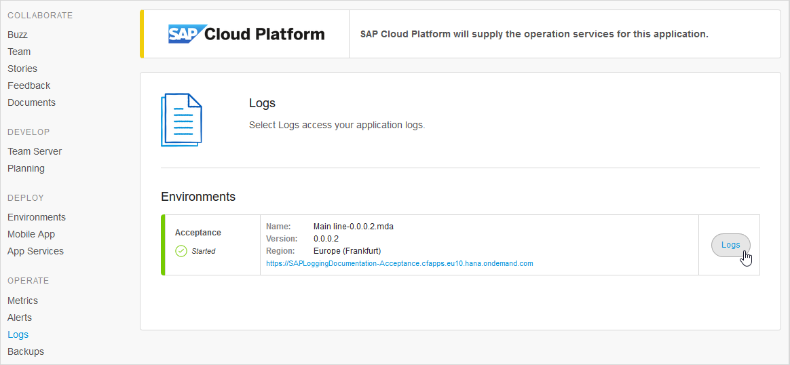

# Logs
Download Archived Log | download a log selected from the list underneath
Download Current Log | view the current log on the screen and download it, if required

## 4 Apps on SAP Cloud Platform

For apps deployed to SAP Cloud Platform you can see the logs using Kibana.

{}
To make full use of Kibana and see proper mapping of the log level, multiline log messages, and stack traces, you will need to configure the *SAP Logger Connector* in your app. For more information see [SAP Logger Connector](/partners/sap/sap-logger).


The logs page shows all the environments for this app. Click the **Logs** button to open the log in Kibana.

You may be asked to provide your SAP credentials before you can see the log in Kibana.

The Kibana user guide is available here: [Kibana User Guide](https://www.elastic.co/guide/en/kibana/current/index.html) and within Kibana. More information on how Kibana is integrated with SAP Cloud Platform is available on the SAP help site here: [Application Logging for the Cloud Foundry Environment](https://help.sap.com/viewer/ee8e8a203e024bbb8c8c2d03fce527dc/Cloud/en-US/68454d44ad41458788959485a24305e2.html).

{}For apps deployed to environments created before 22 October 2018, the *Application Logging (application-logs)* service will not have been bound to your app automatically. To resolve this you can either:

1. Create a new environment and deploy your app there.

2. Bind the service to your existing app by:

    * Going to the SAP Cloud Platform cockpit
    * Going to the space for your environment
    * Finding *Application Logging* in the Service Marketplace
    * Going to *Instances*
    * Creating a *New Instance* and following the instructions, ensuring that you bind it to your app
    * Stopping and starting the app


## 5 Free App

Logs are not available for Free Apps. You will see a sample screen.

## 6 App Deployed to Other Clouds

Logs are not available in the Development Portal for apps running on clouds not mentioned above. You will need to go to the cloud management portal for the cloud to which your app is deployed.
