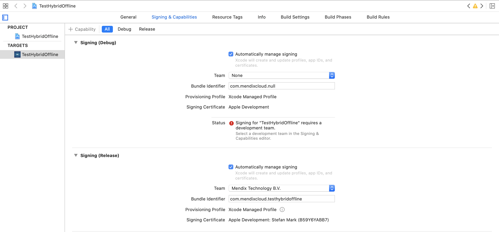
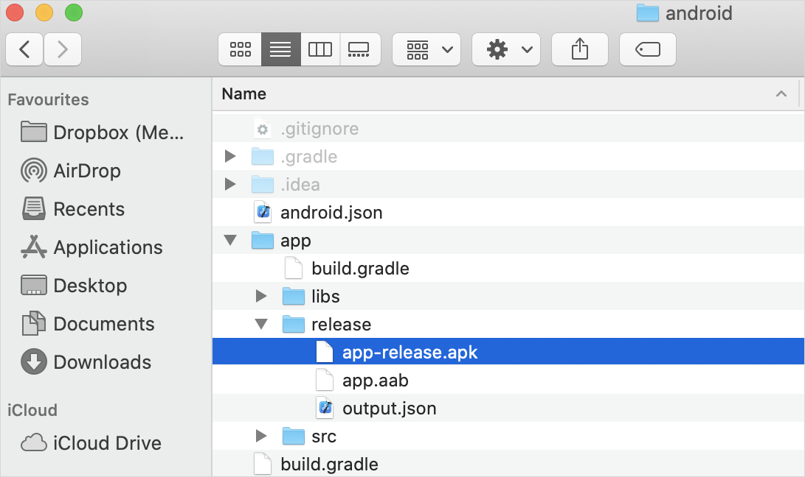
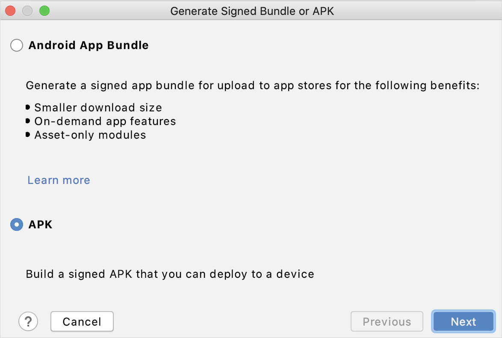

## 1 Introduction

This document describes how to build your hybrid apps locally.

## 2 Building Your iOS App Locally {#building-ios-locally}

**Prerequisites:**

* A Mac OSX machine
* Install [NodeJS LTS](https://nodejs.org/en/download/) using the all-in-one installation option
* Download your [local build package](/developerportal/deploy/mobileapp#doing-it-yourself) from Cloud Portal and unzip it in a known location
* Register for an [Apple Developer Account](https://developer.apple.com/register/index.action)
* Install [XCode](https://apps.apple.com/us/app/xcode/id497799835?mt=12) and its command-line tools

### 2.1 Prepare Your Project for Building

To prepare your project for building, follow these instructions:

1. Open a terminal window and change directory into the unzipped package folder, for example **cd /Downloads/localbuild** if it is in your Downloads folder.
1. Run `npm i && npm run package && npm run platform:ios`. This combination of commands does the following:
   * Installs all required dependencies.
   * Packages the Cordova app for deployment.
   * Adds the iOS platform to Cordova.

### 2.2 Building Your Prepared Project

There are two possible ways to build your apps: the Cordova CLI or XCode. The Cordova CLI is faster and allows Cordova to fully control the your project's configuration. XCode is more involved, but XCode's UI makes it easier to detect problems in the project. You can use whichever works best for your case.

#### 2.2.1 Building iOS Using the Cordova CLI

**Prerequsites:**

* Your Apple Developer team's id, which can be found [here](https://developer.apple.com/account/#/membership/)

This process is shorter than using XCode but might require more work to understand why a build fails. To build using the Cordova CLI, do the following:

1. Run `npm run build -- ios --release --device --codeSignIdentity="iPhone Developer" --developmentTeam="<your-teams-id>"`. This combination of commands does the following:
   * Starts a release build that will create binaries for a physical device
   * Uses the code sign identity "iPhone Developer" for signing \* Looks up the provisioning files and certificates using the provided Apple Developer's team id
   1.1 Optionally, if you wish to build for an emulator and do a debug build use the following command instead: `npm run build -- ios --debug --emulator`.
1. When the build succeeds the generated _IPA_ file can be found in _/build/platforms/ios/build_. That folder should have the following file structure(if you did a build for an emulator an _.app_ file will be available):

   

1. The IPA generated can be now uploaded to Testflight for further testing. If you wish to do so, continue with the [Upload tools](https://help.apple.com/app-store-connect/#/dev82a6a9d79) section in the Apple App Store documenation.

#### 2.2.2 Building iOS using XCode

Using XCode can be easier than the Cordova CLI due to XCode's friendly visual interface. To build your app using XCode do the following:

1.  Under **/build/platforms/ios/** open the `.xcworkspace` file by double-clicking it. Xcode should open with the project loaded:

    {}{}

1.  Select the root element from the tree view in the left-side panel:

    {}{}

1.  The screen should change to the following view. If it does not, select the item under **Targets** on the left panel not the item under **Project** and select the tab **Signing & Certificates**:

    {}{}

1.  Both **Debug** and **Release** might have been configured for **Automatically manage signing**. Clear both check boxes to switch to manual signing. The screen should change to the following:

    {}{}

1.  Enable **Automatically manage signing** again.
1.  Select a **Team** using the drop-down menu. If you have not yet signed in with your credentials, XCode will prompt you to do so.
1.  When configured correctly all errors should be gone.
1.  Make sure you select the target to be your app's build target and designate **Generic iOS Device** as a device:

    {}{}

1.  Select **Product** and then **Archive** from the menu bar:

    {}{}

1.  After the process finishes successfully the **Organizer** view will come up. Your app should be selected and your latest **Archive** visible. You can always open the organizer yourself through XCode's **Window** menu:

    {}{}

1.  You can now use the **Distribute App** button to distribute your app to the appstore or archive it for local distribution:

    {}{}

## 3 Building Your Android App Locally {#building-android-locally}

**Prerequisites:**

* Install [AndroidStudio](https://developer.android.com/studio)
* Install [NodeJS LTS](https://nodejs.org/en/download/) using the all-in-one installation option
* Install JDK 1.8
* Create a keystore using [generating-a-keystore](/refguide/managing-app-signing-keys#3-1-generating-a-keystore)
* Download the [local build package](/howto/mobile/customizing-phonegap-build-packages#download-local-package) from Cloud Portal and unzip it in a known location

### 3.1 Prepare Your Project for Building

To prepare your project for building, follow these instructions:

1. Open a terminal window and change directory into the unzipped package folder, for example **cd /Downloads/localbuild** if it is in your **Downloads** folder.
1. Run `npm i && npm run package && npm run platform:android`. This combination of commands does the following:
   * Installs all required dependencies
   * Packages the Cordova app for deployment
   * Adds the Android platform to Cordova

### 3.2 Set Up Environmental Variables

To be able to run the commands to build locally, you will need to set up some required environmental variables for your system. These can be set to temporary for the current command line session or globally for your system. The variables are the following:

* **ANDROID_SDK_ROOT**, pointing to the installation folder of the Android *SDK*
* **JAVA_HOME**, pointing to the *JDK* 1.8 root directory
* **GRADLE_HOME**, pointing to a valid Gradle distribution directory

During this guide you will set the commands to temporary for each of the commands.

### 3.3 Building Your Prepared Project

There are two possible ways to build your apps: the Cordova CLI or Android Studio. The Cordova CLI is faster and allows Cordova to fully control the your project's configuration. Android Studio is more involved, but Android Studio's UI makes it easier to detect problems in the project. You can use whichever works best for your case.

#### 3.3.1 Building Android Using the Cordova CLI

The command to build your project locally for release is `npm run build -- android --release`.

1.  Run the following command:
   
	a. **On Mac OSX, as a single command run:**<br />

	```
	PATH="\$PATH:/Users/<username>/.gradle/wrapper/dists/gradle-5.1.1-all/97z1ksx6lirer3kbvdnh7jtjg/gradle-5.1.1/bin" JAVA_HOME=`/usr/libexec/java_home -v 1.8\` npm run build -- android --release -- --keystore=<keystore-path> --storePassword=<keystore-password> --alias=<keystore-alias> --password=<certificate-password>
	```

	b. **On Windows, in a command line as separate commands run:**<br />

	```
	set PATH=%PATH%;C:\path-to-gradle-distribution

	set JAVA_HOME=C:\path-to-jdk-1.8-directory

	npm run build -- android --release -- --keystore=<keystore-path> --storePassword=<keystore-password> --alias=<keystore-alias> --password=<certificate-password>
	```

	This command adds the gradle binary to the path, switches the JAVA *JDK* to be 1.8, and runs the build release command to generate a signed *APK*.

1. When the build succeeds the generated *APK* file can be found in **/build/platform/android/app/release**:

	{}{}

#### 3.3.2 Building Android Using Android Studio

Using Android Studio can be easier than the Cordova CLI due to Android Studio's friendly visual interface. To build your app using Android Studio do the following:

1. Start Android Studio:

	{}{}

1. Open an existing Android Studio project and select your project's Android folder, for example **/Downloads/localbuild/build/platform/android**:

	{}{}

1. Wait for Android Studio to finish syncing your project.
1. Click the **Build** > **Generate Signed Bundle / APK**:

	{}{}

1. Select the *APK* checkbox:

	{}{}

1. Select your Android keystore and complete the form with the correct keystore password, alias, and password:

	{}{}

1. Select the destination folder for the *APK*, **Build Variant** release, and **V1 and V2 Signature** versions:

	{}{}

1. Click **Finish**.

You *APK* should now be generated and signed using Android Studio. The resulting *APK* can be found in the output folder selected and can be uploaded via the Google Play Console for further processing.

## 4 Read More

* [Deploy and Manage Guide](/developerportal/deploy)
* [Offline Reference Guide](/refguide/offline-first)
* [How to Publish a Mendix Hybrid Mobile App in App Stores](/howto/mobile/publishing-a-mendix-hybrid-mobile-app-in-mobile-app-stores)
* [Apache Cordova Reference Config.xml](https://cordova.apache.org/docs/en/latest/config_ref/)
