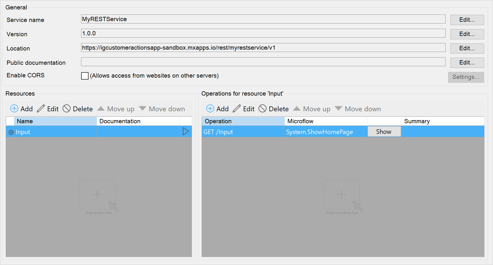
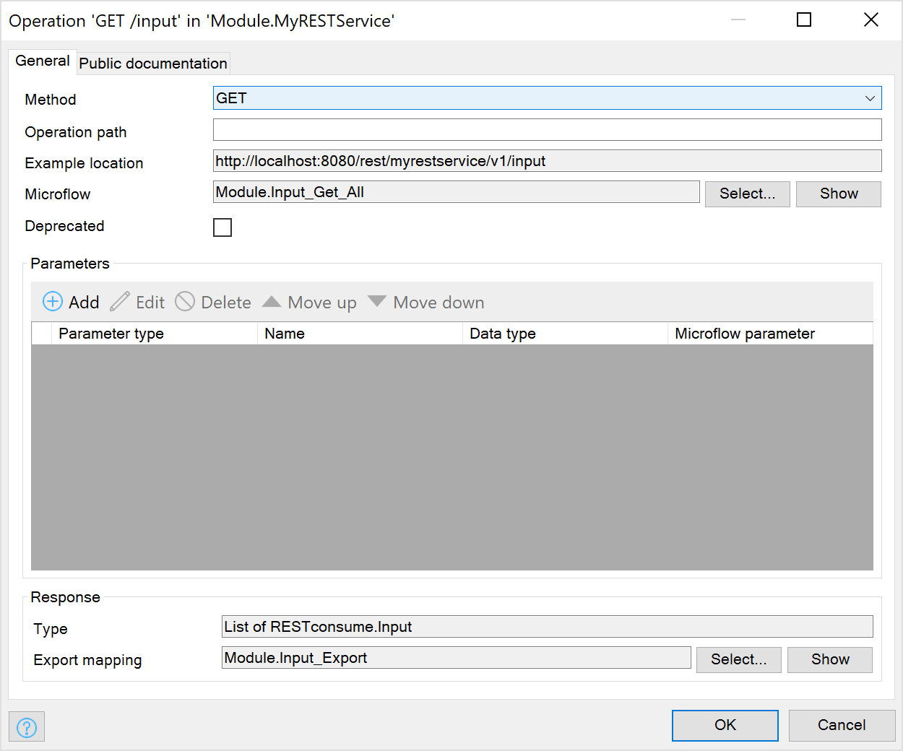

## 1 Introduction

A published REST operation is part of a [published REST resource](published-rest-resource) and defines an endpoint that a client can call to GET, PUT, POST, PATCH, or DELETE items from the resource.

In the **Published REST Service** document you can add items to be included in the service as **Resources**:

## 2 Operation Definition

When you **Add** or **Edit** a resource, you can define the resource in the **Operation** definition dialog box for the selected item as follows:

### 2.1 General

In the **General** tab, you can enter the operation details as described in this section.

#### 2.1.1 Method

The method specifies the type of operation that is performed by the microflow. From the drop-down menu you can select one of the following:

* **GET** – retrieve the entry or entries at the specified location
* **PUT** – replace the entry or entries at the specified location, or create them if they do not exist
* **POST** – create an entry in the collection at the specified location
* **PATCH** – update (part of) the entry at the specified location
* **DELETE** – delete the entry or entries at the specified location
* **HEAD** - retrieve information about the entry or entries at the specified location; this is identical to **GET**, except that a message body is not returned
* **OPTIONS** - return information about the available communication options

#### 2.1.2 Operation Path{#operation-path}

The location where the operation can be reached starts with the URL of the resource and the **Operation path** specifies the remainder of the path for the operation. You can leave it empty to use the location of the resource.

You can use [path parameters](published-rest-path-parameters) to capture part of the location as a microflow parameter or as a parameter to the import mapping. Specify path parameters in the operation path between `{` and `}`. The value that is in the URL for the path parameter will be passed to the microflow or the import mapping.

The **Method** and **Operation path** define the operation that is executed for a given request URL as described in [Published Rest Routing](published-rest-routing).

#### 2.1.3 Example Location{#example-location}

The **Example Location** gives an example of a URL on which the operation can be reached. 

#### 2.1.4 Microflow

An operation can have the following parameters:

 * [Query parameters](published-rest-query-parameters), which are at the end of the URL in the form of `?name1=value1&name2=value2` 
   {}
   When a microflow parameter is not in the path and is not an object, then it is considered to be a query parameter.
   {}
* [Path parameters](published-rest-path-parameters), which form part of the path of the URL
* A body parameter (optional), which is in the body of the request to the operation 
   {}
   The **GET**, **HEAD**, and **DELETE** operations do not have a body parameter.
   {}
* Header parameters, which come from the HTTP headers of the request
* A form parameter (optional), which is a part of the body of a multipart form request

A microflow for an operation takes these operation parameters as input.

A microflow parameter that has the *List* or *Object* type indicates a body parameter. You can specify an import mapping to convert the incoming JSON or XML. A parameter of the *FileDocument* type (or that inherits from a *FileDocument*) is special: It can also be used for form parameters, and an import mapping is not needed.

An operation microflow may also take an [HttpRequest](http-request-and-response-entities#http-request) parameter. You can add this parameter if you want to inspect the requested URL and headers.

To set the status code, reason phrase, and headers, add an [HttpResponse](http-request-and-response-entities#http-response) object parameter and set the attributes of that object, or return an *HttpResponse*.

The result of the microflow is the result of the operation and can include the following:

1. **Return a** ***list*** **or an** ***object***– you must specify an export mapping to convert it to XML or JSON.
2. **Return a primitive** – when the microflow returns a value, for example, a string, integer, or Boolean, then the response to the operation will be that value. 
   {}
   If a non-empty value from the microflow is returned, the *Content* attribute of the *HttpResponse* object is ignored. 
   If an empty value from the microflow is returned, then the *Content* of the *HttpResponse* is taken as the result.
   {}
3.  **Return a file document** – when you want to return data that is a file (such as a PDF or image), then the microflow returns a file document.
4. **Return a** [HttpResponse](http-request-and-response-entities#http-response) – in the *HttpResponse*, you can set the status code, reason phrase, and content (as a string). You can fill the content with, for example, the result of a mapping or a string from another source. You can also add headers to the response. 
   {}
   One important header to set is *Content-Type*. Do not return an *empty* *HttpResponse* because that will always result in an error.
   {}

If the microflow throws an unhandled exception, the response is **500: Internal server error**.

When security is enabled, then then microflow needs to have at least one role configured to be accessible.

#### 2.1.5 Deprecated

Check this box to mark the operation as deprecated in the service's OpenApi (Swagger) documentation page as described in the [Documentation](published-rest-services#interactive-documentation) section of [Published REST services](published-rest-services). This informs clients not to use it anymore.

#### 2.1.6 Parameters

You can **Add**, **Update** or **Delete** the parameters of the operation which is described in [Operation Parameters for Published REST](published-rest-operation-parameter).

##### 2.1.6.1 Import Mapping {#import-mapping}

For a body parameter, you can select an [import mapping](import-mappings) that converts the body of the request into an object. All object and list parameters except file documents must have an import mapping selected. 

To select an import mapping, double-click the parameter or click **Edit** in the grid after you select the parameter. When selecting the import mapping, you can also choose the commit behavior of the mapping: you can choose to either commit, commit without events, or not commit imported objects.

You can select an import mapping that takes no parameter, or an import mapping that takes a primitive parameter (for example, string, integer). If you select an import mapping with a primitive parameter, you need to have exactly one [path parameter](published-rest-path-parameters) with the same type. That path parameter will be passed to the import mapping.

You can indicate what should happen **if no object was found** when the import mapping has checked the box **decide this at the place where the mapping gets used**.

If you select an import mapping that supports both XML and JSON (for example, a mapping that is based on a message definition), then the operation will be able to handle both XML and JSON requests.

Valid requests must contain a *Content-Type* header. See [Recognized media types](#table1) for a list of media types that are understood by the import mapping. If an unsupported content type is used, the operation will result in a "**400 Bad Request**" response.

The import mapping is also used to generate object schemas for operation responses in [OpenAPI (Swagger) documentation page](published-rest-services#interactive-documentation) based on [JSON Schema](published-rest-service-json-schema)

#### 2.1.7 Response
This defines the response of the operation. You can specify the type of the microflow result and the export mapping applied to it (if any).

##### 2.1.7.1 Type
This shows the result type of the microflow.

##### 2.1.7.2 Export Mapping
When the microflow returns an object or a list of objects, you must specify how this result is mapped to JSON or XML. Select an export mapping that takes the result of the microflow as input.

If you select an export mapping that supports both XML and JSON (for example, a mapping that is based on a message definition), then the output depends on whether the microflow has a parameter of type *System.HttpResponse* and adds a *Content-Type* header to it. The possible scenarios are given below:

* When the microflow sets the *Content-Type* header parameter with a media type that is XML, then the operation returns XML as given in the table below.

    <a name="table1">**Recognized media types**</a>

	| Media Type                   | Recognized As |
	| ---                          | --- |
	| *application/xml*            | XML |
	| *text/xml*                   | XML |
	| anything ending with *+xml*  | XML |
	| *application/json*           | JSON |
	| anything ending with *+json* | JSON |

* When the microflow sets the *Content-Type* header to something else, then the operation returns JSON.

* When the microflow does not set the *Content-Type* header, then the output is determined by inspecting the *Accept* header in the request. The first media type that is recognized to be XML or JSON (as given in the table above) determines the operation result: the *Content-Type* is *application/xml* (when it is XML) or *application/json* (when it is JSON).

* When there is no *Accept* header or the *Accept* header does not contain a recognizable media type, then the operation returns JSON and the *Content-Type* is *application/json*.

The export mapping is also used to generate object schemas for operation responses in the [OpenAPI (Swagger) documentation page](published-rest-services#interactive-documentation) based on the [JSON schema](published-rest-service-json-schema).

### 2.2 Public Documentation

In the **Public Documentation** tab you can specify the documentation that will be used in the service's [OpenAPI (Swagger) documentation page](published-rest-services#interactive-documentation).

#### 2.2.1 Summary {#summary}
Provide a short description of what the operation does.

#### 2.2.2 Description {#description}
Enter a complete overview of what the operation does. You can use [GitHub-flavored markdown](gfm-syntax) syntax to style the text.

