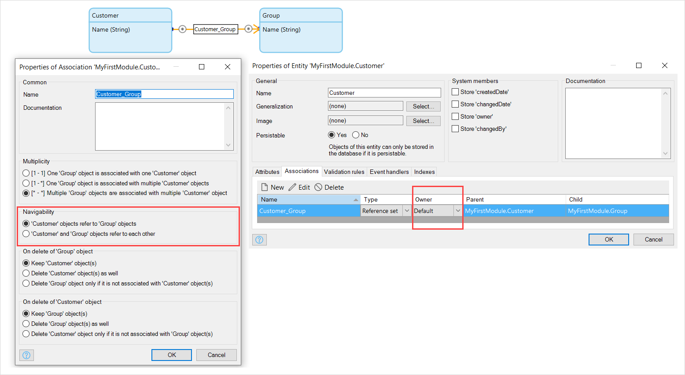
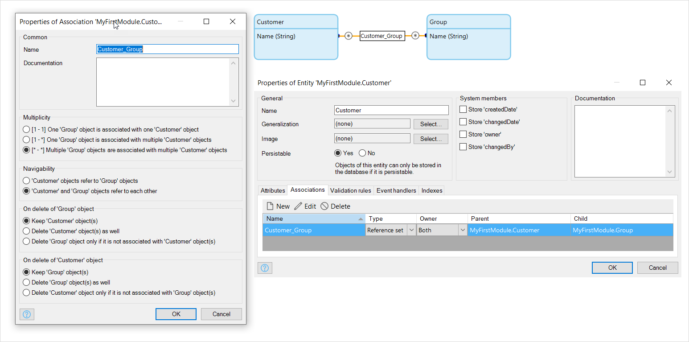
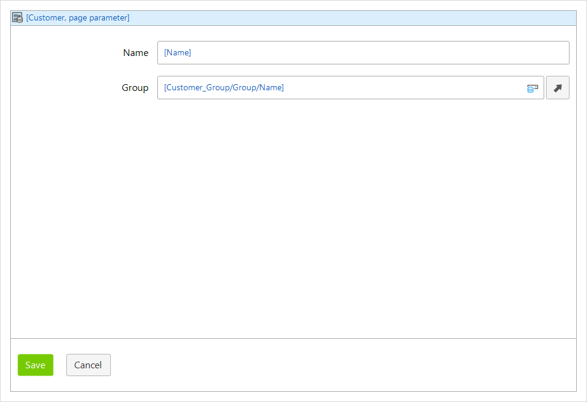

{}The **input reference set selector** widget is not supported on native mobile pages.{}

## 1 Introduction

An **input reference set selector** is used to allow the end-user to display or select the value(s) of a many-to-many (reference set) [association](associations) by selecting the associated object(s).

An input reference set selector must be placed in a [data widget](data-widgets).

For example, you could group customers into groups, and each customer could belong to several groups. Each Group can have many customers. The entities **Customer** and **Group** have a many-to-many (reference set) relationship. An input reference set selector can be used to select the groups the customer belongs to.

What you can do with an input reference set selector depends on the **Owner** of the association. In the example domain model below, **Owner** is set to **Default** (in the association properties **'Customer' objects refer to 'Group' objects**).

You can put an input reference set selector in a Customer data view to allow the user to select the Group(s) to which the customer belongs. However, because the Customer is the owner of the association, you cannot put an input reference set selector in a Group data view to select the Customer(s) in the Group.

To allow you to both add a Group to a Customer, and add a Customer to a Group, you need to set ownership of the association to **Both**.

In the input reference set selector, the path to the attribute to be displayed (association, related entity, and attribute) is shown inside the input reference set selector, displayed between square brackets, and colored blue.

For example, using the domain model above, the following input reference set selector allows the end-user to associate a Customer with one or more Groups by setting the association **Customer_Group**. This is done by selecting the **Name**(s) of the **Group**(s) associated with the current **Customer**.

## 2 Properties

An example of input reference set selector properties is represented in the image below:

{}
{}

Reference set selector properties consist of the following sections:

* [Common](#common)
* [Data source](#data-source)
* [Design Properties](#design-properties)
* [Editability](#editability)
* [Events](#events)
* [General](#general)
* [Label](#label)
* [Selectable Objects](#selectable-objects)
* [Visibility](#visibility)

### 2.1 Common Section {#common}

{}

### 2.2 Data Source Section {#data-source}

{}

The attribute path specifies which attribute(s) of an associated entity is shown in the reference set selector. The path must follow one association, of type reference set, starting in the entity of the data view.

### 2.3 Design Properties Section {#design-properties}

{}

### 2.4 Editability Section {#editability}

{}

### 2.5 Events Section {#events}

The on-change property specifies an action that will be executed when leaving the widget, either by using the <kbd>Tab</kbd> key or by clicking another widget, after the value has been changed.

{}

### 2.6 General Properties {#general}

#### 2.6.1 Select Page

The select page property determines which page is displayed when the input reference selector is clicked. This page can be used to select associated objects from the list of selectable objects. This page should contain a data grid, template grid or list view connected to the same entity as the input reference set selector.

If an input reference set selector is never editable, a select page is not required.

See the [Show a Page](on-click-event#show-page) section of *On Click Event & Events Section*. Note that select pages must have a [pop-up layout](layout#layout-type).

{}
You can generate a new page to show by right-clicking the widget and selecting **Generate select page…**.
{}

### 2.7 Label Section {#label}

{}

### 2.8 Selectable Objects Section {#selectable-objects}

The properties in the Selectable objects section determine the objects from which the end user can make a selection. You can add an **XPath constraint**, or use a **Constrained by** path.

For more information, see the [XPath](reference-selector#xpath-constraints) section of *Reference Selector*.

{}
You cannot use a microflow to define selectable objects in an input reference set selector.
{}

### 2.9 Visibility Section {#visibility}

{}
