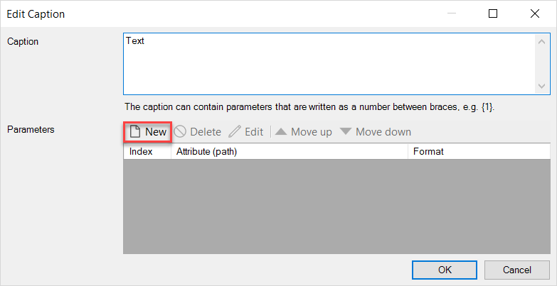
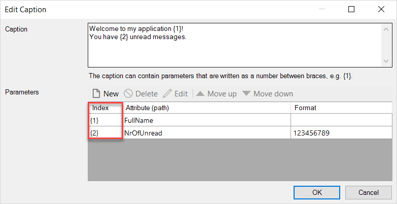
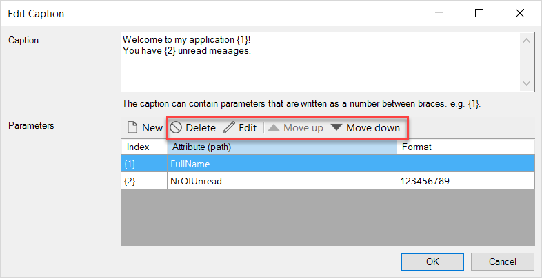

## 1 Introduction

The text widget displays a text which can contain parameters if necessary. Every attribute is replaced with the value of this attribute. For example, you can show a greeting message to a user by placing a text widget in a [data view](data-view) and adding parameters to it.

If you start typing in any empty container, Studio Pro will automatically generate a text widget to display your text.

## 2 Properties

An example of text properties is represented in the image below:

{}
{}

Text properties consist of the following sections:

* [Common](#common)
* [Design Properties](#design-properties)
* [General](#general)
* [Visibility](#visibility)

### 2.1 Common Section {#common}

{}

### 2.2 Design Properties Section {#design-properties}

{} 

### 2.3 General Section {#general}

#### 2.3.1 Caption {#caption}

**Caption** defines a text that will be shown. The caption can contain parameters that are written between braces, e.g. {1}.  

For more information on using parameters, see the [Parameters]() section below. 

#### 2.3.2 Parameters {#parameters}

Parameters are attributes the value of which will be displayed. To view **Parameters**, do one of the following:

* Double-click the **Caption** setting in properties

*  Double-click the text widget on the page and click **Edit** in the **General** section > **Caption**:

     

Parameters have the following settings:

* **Index** – an identification number of a parameter 

* **Attribute (path)** – an attribute a value of which will be displayed 

*  **Format** – a format in which an attribute value will be displayed

    

##### 2.3.2.1 Adding New Parameters

To use parameters, do the following:

1. Place the **Text** widget must be placed in a context of an entity, as in, inside a [data widget](data-widgets).

2. Double-click the **Caption** setting in the text widget properties.

3.  In the **Edit Caption** dialog box > **Parameters** section click **New**:

    

4. In the **Edit Template Parameter** dialog box, click **Select**, choose an attribute and confirm your choice.

5.  In the **Caption** setting, write the text you would like to display and type **Index** of the parameter you would like to include. In the example below, to include a full name of your customer and a number of unread messages, you need to use indexes {1} for the *FullName* attribute, and {2} for the *NrOfUnread* attribute:  

    

##### 2.3.2.2 Performing Other Actions on Parameters

In addition to adding new parameters, you can perform the following actions on parameters:

* **Delete** – to delete a parameter click Delete or press <kbd>Delete</kbd> on your keyboard

* **Edit** – double-click a parameter to edit it or click Edit

* **Move up** – to move a parameter up in the list of parameters and also to change its index, click **Move up**

*  **Move down** – to move a parameter down in the list of parameters and also to change its index, click **Move down**

    

#### 2.3.3 Render Mode

The render mode determines how the text will be displayed. 

| Value     | Description |
| --------- | ----------- |
| Text  *(default)*      | The text will be rendered inline with the previous/next texts on a page (`` tag in HTML). |
| Paragraph | The text will be rendered as a separate paragraph (`
` tag in HTML). |
| Heading 1 - Heading 6 | The text will be rendered as a selected heading (for example, `<h1>` tag in HTML). **Heading 1** is the largest type of heading, **Heading 6** is the smallest one. |

### 2.4 Visibility Section {#visibility}

{}

## 3 Read More

* [Page](page)
* [Common Widgets](common-widgets)
* [Properties Common in the Page Editor](common-widget-properties)